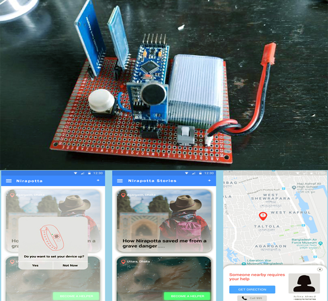

# nirapotta app
Mobile application built with native Android, having been called by some the uber for safety issues, when paired with the nirapotta wearable will trigger distress calls to nearby users with location. 

# nirapotta hardware/wearable

Built with Arduino pro mini, Bluetooth HC-05, Led light, switch, LC-277 Mic Module, Li-Po Battery 3.7V, 220 ohm resistor, Vero board and wires. When the distress button/switch is pressed, data being processed by nirapotta app sends out a distress call to users within designated proximity and dynamically changes that according to availability of users. 

# project paper

The scientific paper prepared and written for this project is also available in this repo.

